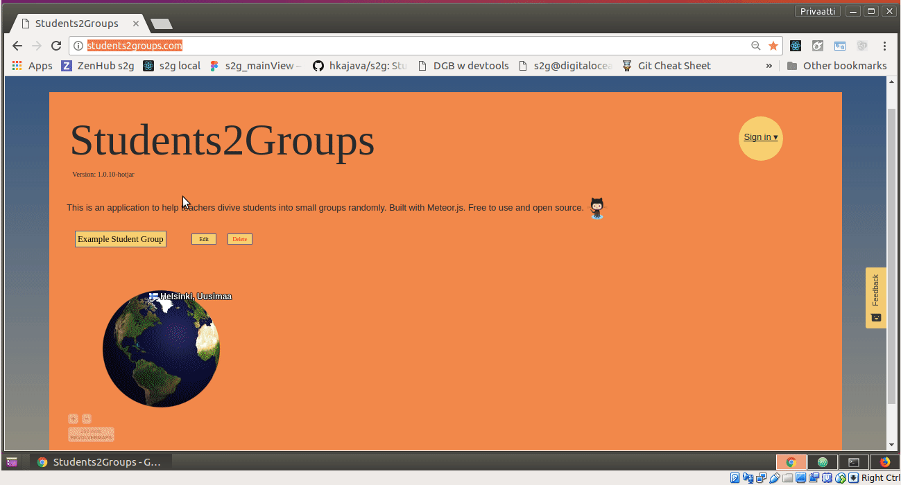

# s2g
Students2Groups Meteor application. Noticed in Spanish conversation class that the teacher doesn't have a good method to divide students into small groups for conversation so this application will provide easy way to do that. Also enjoying Meteor.js/React.js technologies with this application.

Swimming right now in DigitalOcean:
http://students2groups.com/



## Prerequisites for installation

meteor v.1.6+
eslint v.4+
node v. 8+
lessc v. 2.7+
jest v. 21.2+


## Installation

Do git clone on the project
```
>git clone git@github.com:hkajava/s2g.git
>cd s2g
>npm install
```

To run
```
>meteor run
```

## Authors

* **Henri Kajava** - *Initial work* - (https://github.com/hkajava)
* **Renato Moraes De Bonilha** - *Algorithm development*

Dedicated to Spanish teacher Javier Lázaro Ramos.
